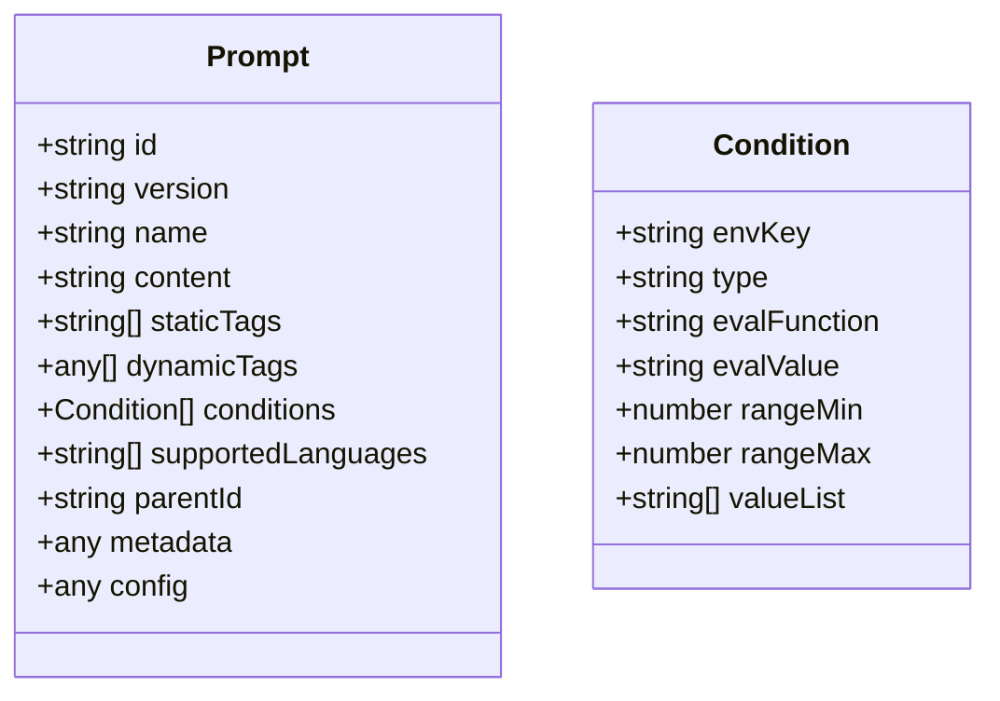

# prompt.types.ts

```mermaid
classDiagram
  class Prompt {
    +string id
    +string version
    +string name
    +string content
    +string[] staticTags
    +any[] dynamicTags
    +Condition[] conditions
    +string[] supportedLanguages
    +string parentId
    +any metadata
    +any config
  }

  class Condition {
    +string envKey
    +string type
    +string evalFunction
    +string evalValue
    +number rangeMin
    +number rangeMax
    +string[] valueList
  }
```
