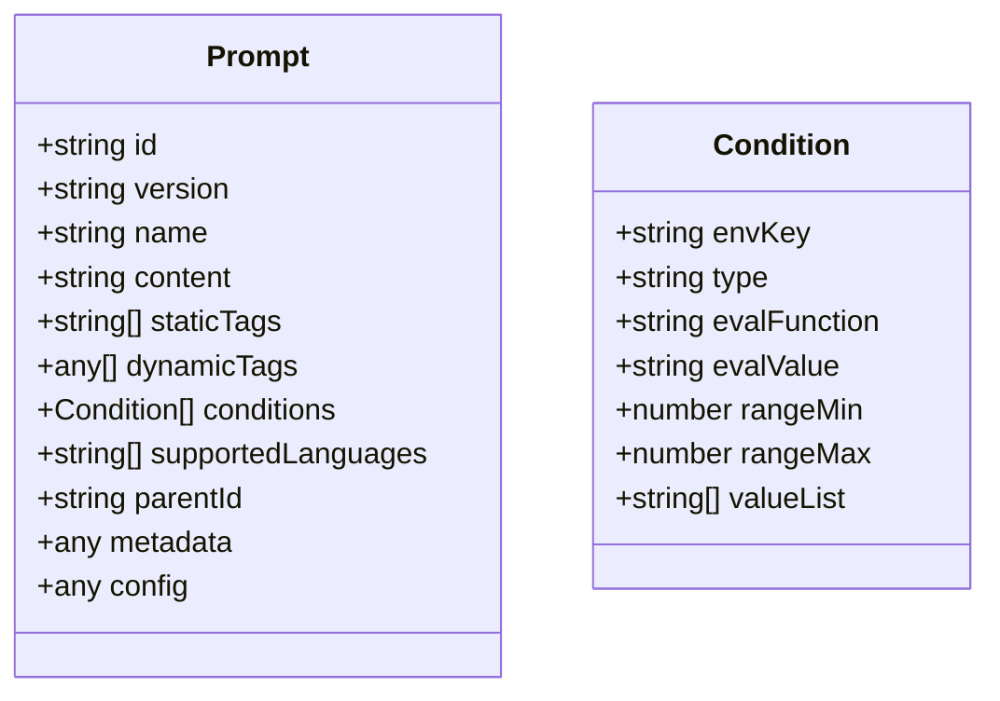
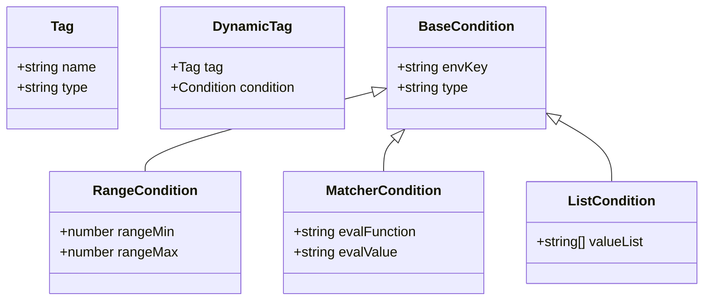
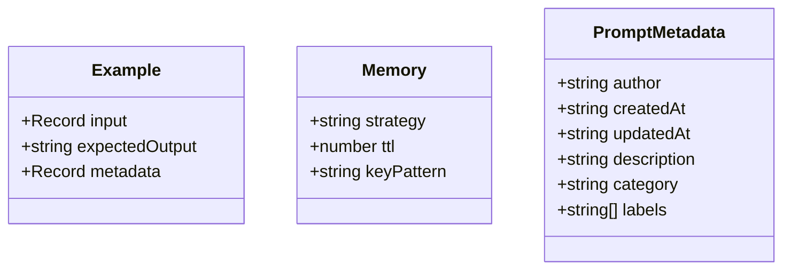

# prompt.types.ts

```mermaid
classDiagram
  class Prompt {
    +string id
    +string version
    +string name
    +string content
    +string[] staticTags
    +any[] dynamicTags
    +Condition[] conditions
    +string[] supportedLanguages
    +string parentId
    +any metadata
    +any config
  }

  class Condition {
    +string envKey
    +string type
    +string evalFunction
    +string evalValue
    +number rangeMin
    +number rangeMax
    +string[] valueList
  }
```

# condition.types.ts

```mermaid
classDiagram
  class Tag {
    +string name
    +string type
  }

  class DynamicTag {
    +Tag tag
    +Condition condition
  }

  class BaseCondition {
    +string envKey
    +string type
  }

  class RangeCondition {
    +number rangeMin
    +number rangeMax
  }

  class MatcherCondition {
    +string evalFunction
    +string evalValue
  }

  class ListCondition {
    +string[] valueList
  }

  BaseCondition <|-- RangeCondition
  BaseCondition <|-- MatcherCondition
  BaseCondition <|-- ListCondition
```
# metadata.types.ts

```mermaid
classDiagram
  class Example {
    +Record<string,any> input
    +string expectedOutput
    +Record<string,any> metadata
  }

  class Memory {
    +string strategy
    +number ttl
    +string keyPattern
  }

  class PromptMetadata {
    +string author
    +string createdAt
    +string updatedAt
    +string description
    +string category
    +string[] labels
  }
```
